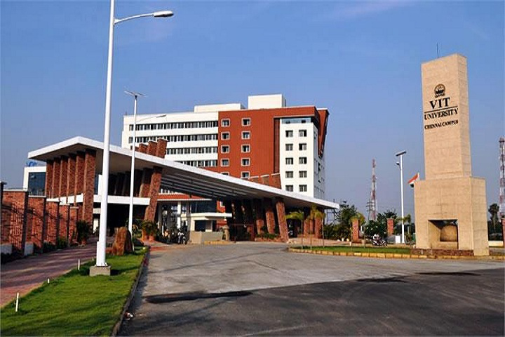

# CBIR Fundamentals
*Date: 04.02.2021*

### Files
- **[c1.m](./c1.m):** MATLAB code to read & display an image
- **[c2.m](./c2.m):** MATLAB code to read & display an image
- **[c3.m](./c3.m):** MATLAB code for color channel seperation & visualization (single color channel)
- **[c4.m](./c4.m):** MATLAB code for color channel seperation & display output in resp. color channel(all color channels)
- **[cl2.m](./cl2.m):** MATLAB code for color channel seperation & display output in grayscale (all color channels)
- **[cl3.m](./cl3.m):** MATLAB code for color channel seperation & display output in HSV, CMY, RBG & Grayscale mapping
- **[cl4.m](./cl4.m):** MATLAB code for color channel seperation & display the mean of resp. channels in command window
- **[cl5.m](./cl5.m):** MATLAB code for color channel seperation & save the mean of resp. channels a file named `channel_mean.txt`
- **[c1_gray.jpeg](./c1_gray.jpeg):** Grayscale image for testing
    
- **[c2_rgb.jpg](./c2_rgb.jpg):** Color image for testing
    

### Output
[![output-c3][oc3]][oc3]
[![output-c4][oc4]][oc4]
[![output-cl3][ocl2]][ocl2]
[![output-cl2][ocl3]][ocl3]
- **[outputs/channel_mean.txt](./outputs/channel_mean.txt):** Generated file containing the Mean of the resp. channel of the image

[oc3]: ./outputs/output-c3.jpg
[oc4]: ./outputs/output-c4.jpg
[ocl2]: ./outputs/output-cl2.jpg
[ocl3]: ./outputs/output-cl3.jpg
