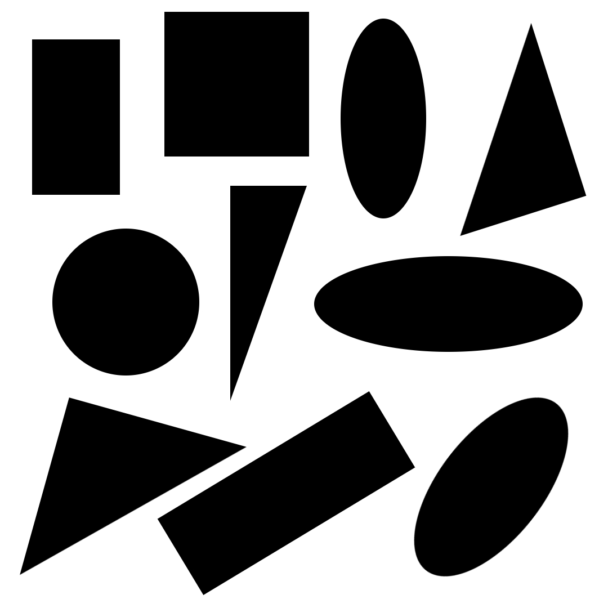
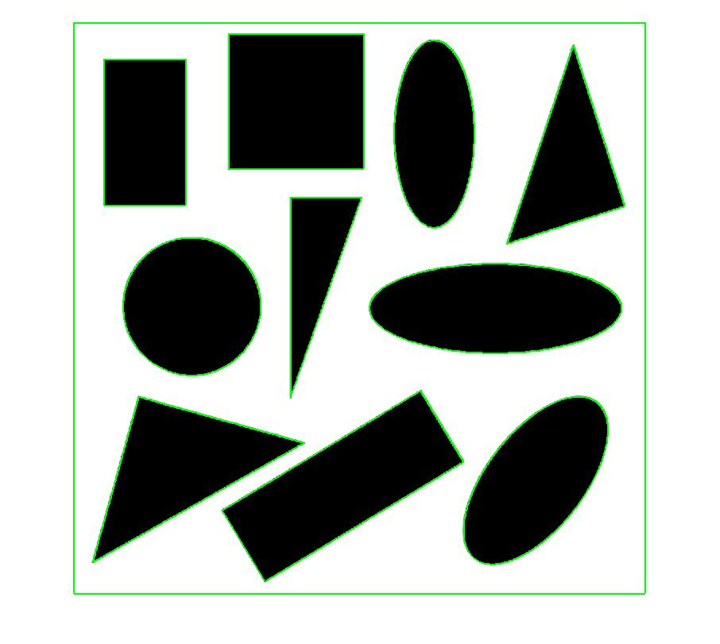
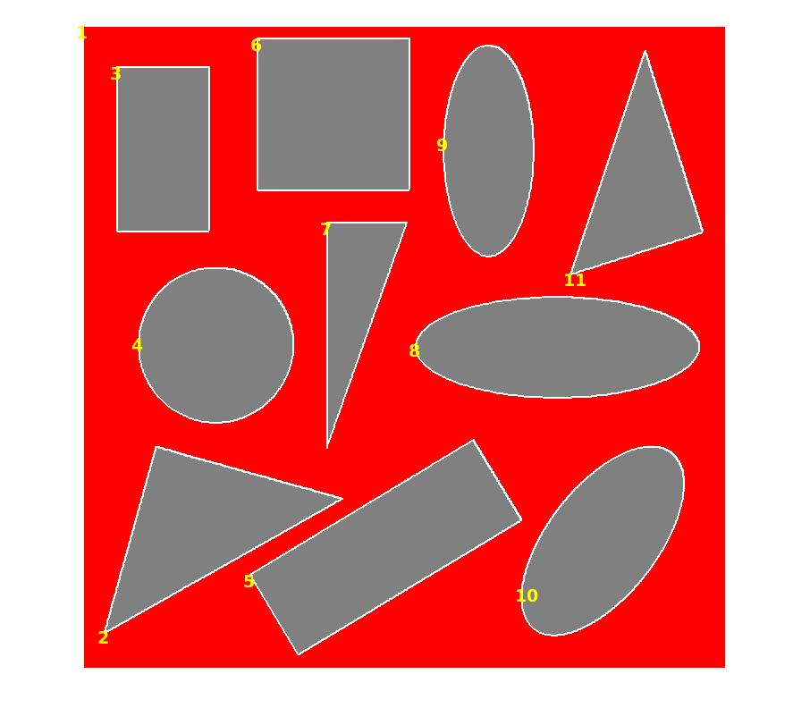

# Shape Based Feature Extraction
*Date: 01.04.2021*

### Files
- **[ex-8--shape-based-feature-extraction.pdf](./ex-8--shape-based-feature-extraction.pdf):** Problem Statement for this Lab experiment
- **[getShapeStats.m](./getShapeStats.m):** MATLAB function to extract Shape statistics for a given image
- **[q1.m](./q1.m):** MATLAB Driver code to implement Shape-based feature extraction
- **[images/test-1.jpg](./images/test-1.jpg):** Generated test image for shape detection

### Output

