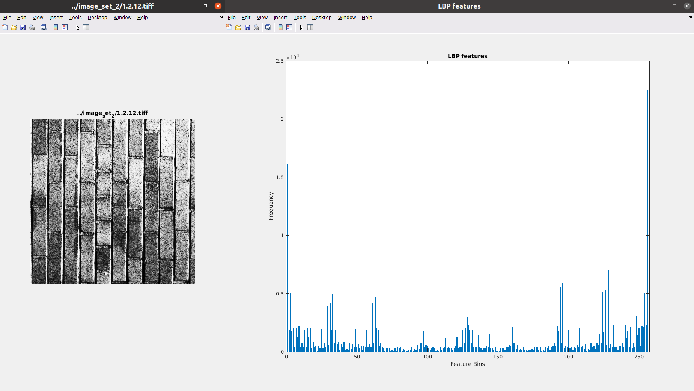

# Extraction of Local Binary Patterns from an Image
*Date: 08.04.2021*

### Files: 
- **[lbp.m](./lbp.m):** MatLab function to extract bin-specific LBP features for a given image
- **[q1.m](./q1.m):** MatLab Driver code to implement LBP function

### Output:


### Developer Notes:
---
#### Converter Algorithm Explanation
**Distance = 1  implies Converter Dimension: 3x3**
|   | **1** | **2** | **3** |
|:-----:|:-----:|:-----:|:-----:|
| **1** | 1     | 2     | 3     |
| **2** | 8     | 0     | 4     |
| **3** | 7     | 6     | 5     |

**Distance = 2  implies Converter Dimension: 5x5**
|   | **1**  | **2**  | **3**  | **4**  | **5** |
|:---:|:---:|:---:|:---:|:---:|:---:|
| **1** | 1  | 2  | 3  | 4  | 5 |
| **2** | 16 | 0  | 0  | 0  | 6 |
| **3** | 15 | 0  | 0  | 0  | 7 |
| **4** | 14 | 0  | 0  | 0  | 8 |
| **5** | 13 | 12 | 11 | 10 | 9 |

Let's say, distance = 2
implies, `convertor_dimension = 5 x 5`
implies, `convertor_dimension = (2*distance + 1) x (2*distance + 1)`
implies, `convertor_size = 2*distance + 1`

**For `i = 1:5` viz. `i = 1:cnv_size`**
**For top,** 
`cell(1, i) = i`
**For bottom,**
`i = 1` gives 
```math
13 = 2*4 + 5 - i + 1 = 2*(5-1) + 5 - i + 1
```
`cell(5, i) = (2*(cnv_size-1) + cnv_size - i + 1)`

**For `i = 2:4` viz. `i = 2:cnv_size-1`**
**For right,**
`i = 2` gives
```math
6 = 5 + 2 - 1 = 5 + i - 1
```
`cell(i, 5) = cnv_size + i - 1`
**For left,**
`i = 3` gives
```math
15 = 16 - 1 = 16 - 3 + 2 = 8*distance - i + 2
```
`cell(i, 5) = 8*distance - i + 2`

---

Tables created using [Table Convert Online](https://tableconvert.com/)

