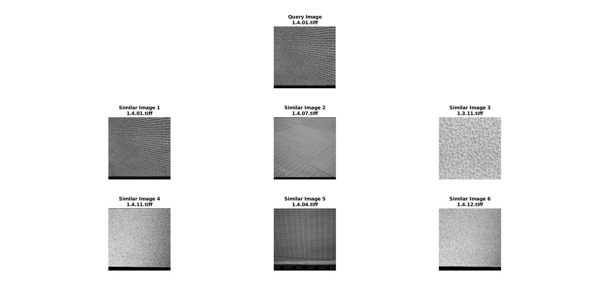

# Implementation of HOG Features based CBIR Systems
*Date: 13.05.2021*

### Files
- **[q1.m](./q1.m):** Matlab driver code to implement CBIR using HOG features
- **[hog_feature_vector.m](./hog_feature_vector/hog_feature_vector.m):** Function to extract the HOG (Histogram of Oriented Gradients) feature vector for a given image. Code downloaded from [here](https://in.mathworks.com/help/vision/referencelist.html?type=function&category=feature-detection-and-extraction&s_tid=CRUX_topnav).

### References
- [How to call function placed in another directory in Matlab? - StackOverflow](https://stackoverflow.com/a/38040355)

### Output

